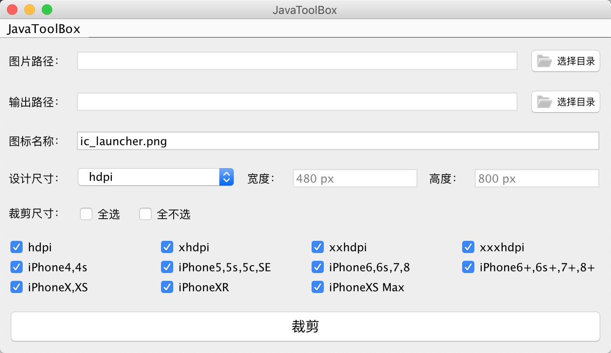
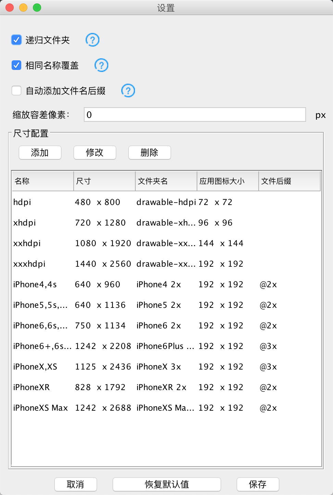

## JavaToolBox
使用Java Swing技术将常用的工具封装成可运行的JAR包。其中裁剪图片的功能是从[AndroidImageCrop](https://github.com/ALonelyTraveler/AndroidImageCrop)重制来的，原裁剪功能本是对Android图片进行生成，后由于需求变更，添加了针对iOS图片的兼容，后期将不断完善和优化。

### 功能介绍
#### 裁剪工具
1. 自动裁剪多分辨率图片；
2. 添加设置功能；
3. 可配置分辨率；
4. 自动添加iOS中的"@2x"/"@3x"文件名后缀；
5. 版本更新提醒；

### 版本更新
#### V1.0.0-Beta（重制版本）
1. 添加版本更新提醒；
2. 截图进度显示；
3. 允许生成的文件名添加后缀；
4. 管理裁剪分辨率，无需再手动修改配置；
5. 添加“关于”；
6. 添加“容差值”解决整屏图iOS裁剪缺少若干像素；
7. 添加菜单栏；

### 截图

### 增强功能（待开发）
* 在多平台上安装右键菜单
* 应用程序图标生成工具（自动生成所有尺寸[圆角]图标）
* 自动生成iOS图片的.appiconset和.imageset文件夹
* 增加图片压缩比例，生成更小的图片文件
* 卸载功能